# Spicy Strava 🔥

Get roasted for your Strava activities. Because sometimes you need honest feedback about that "easy recovery run."

## Screenshots

### Login & Activities
<p align="center">
  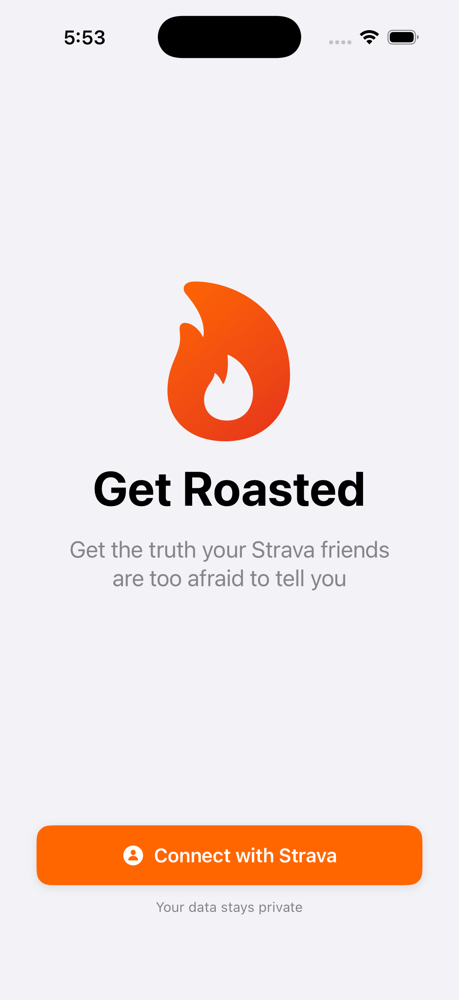
  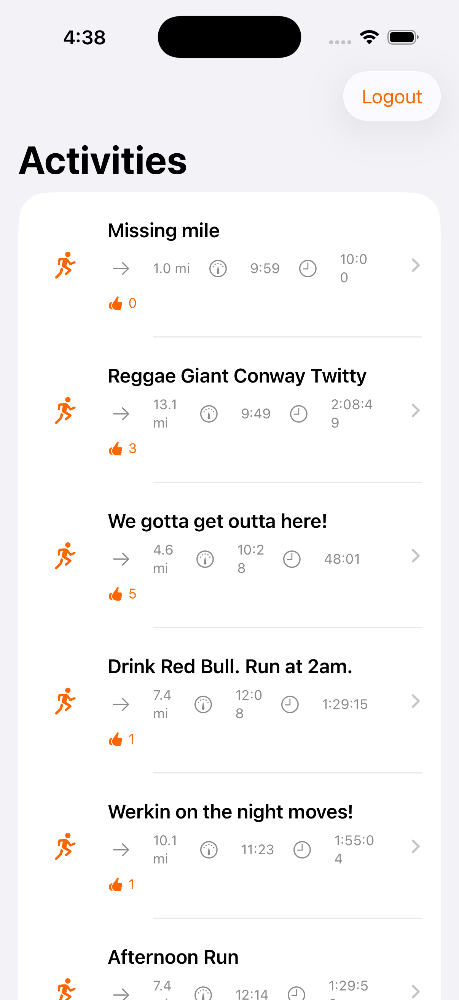
  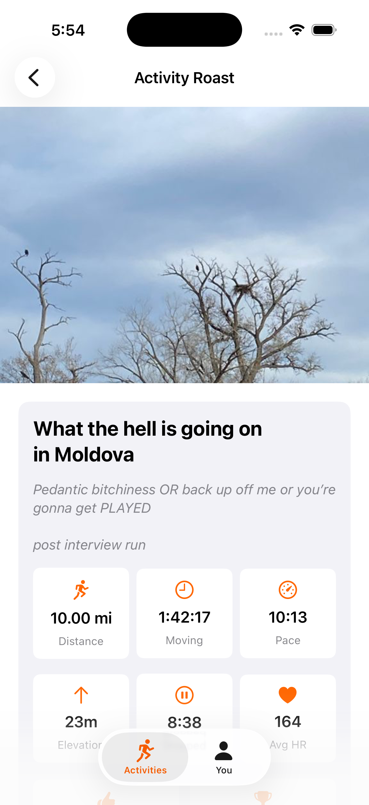
</p>

### Activity Roast
<p align="center">
  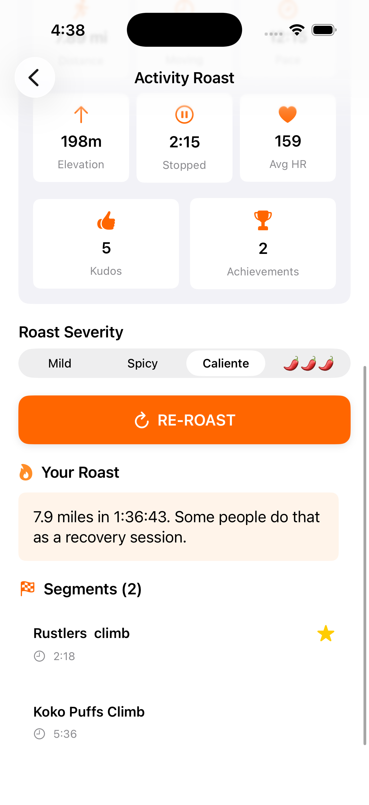
  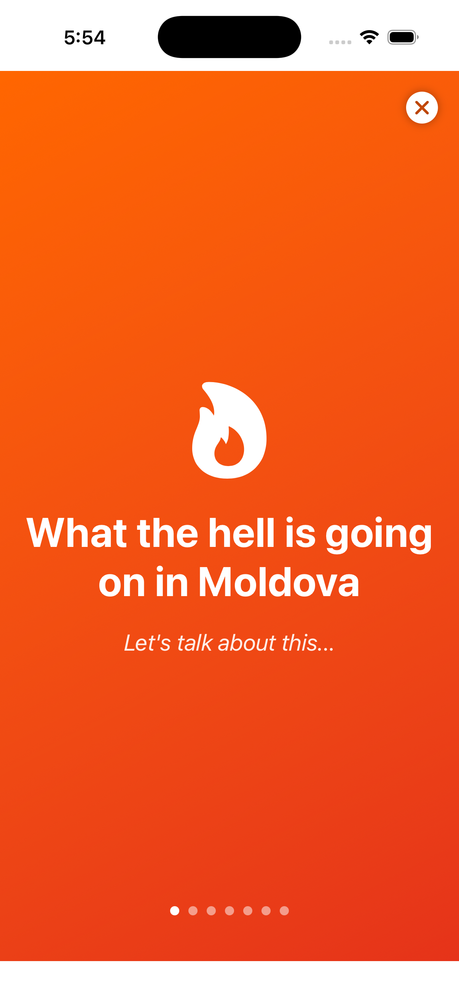
  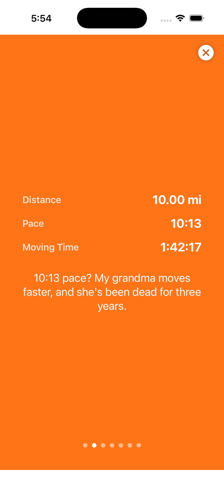
</p>

<p align="center">
  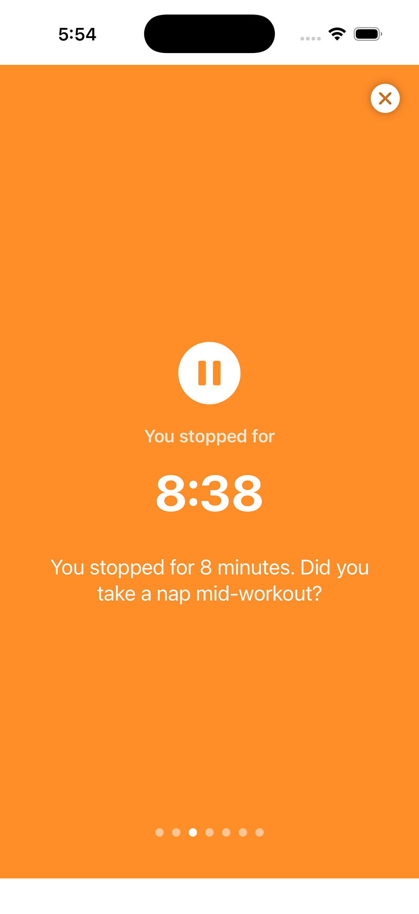
  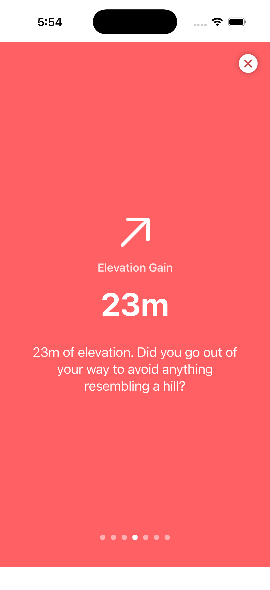
  
</p>

<p align="center">
  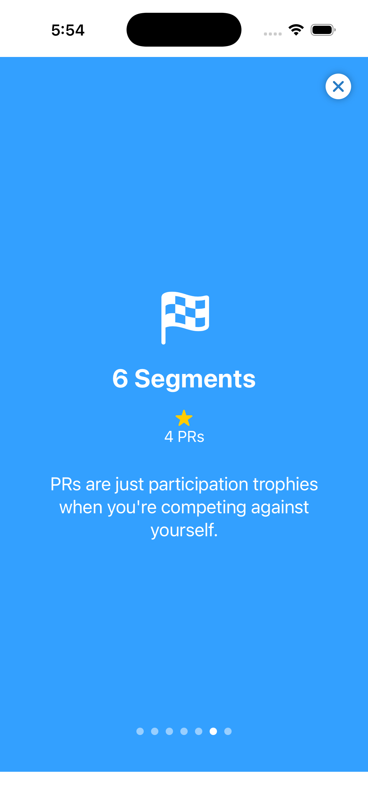
  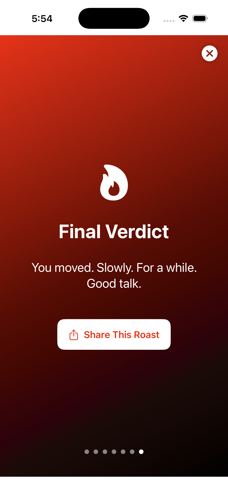
</p>

### Settings & Stats
<p align="center">
  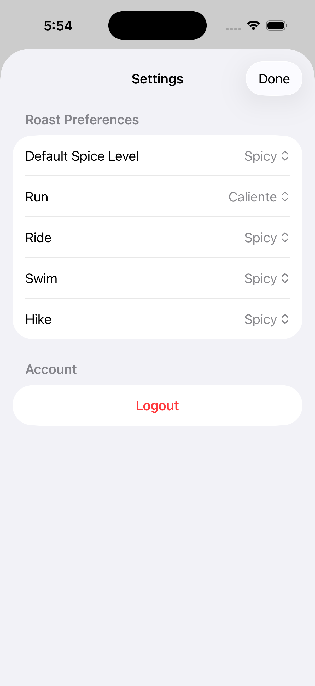
  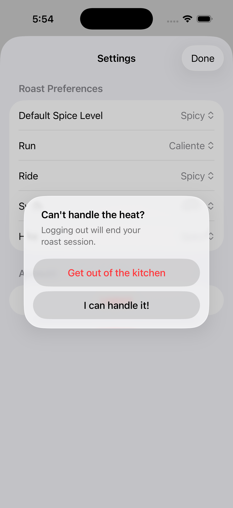
  
</p>

### Aggregate Wrapped
<p align="center">
  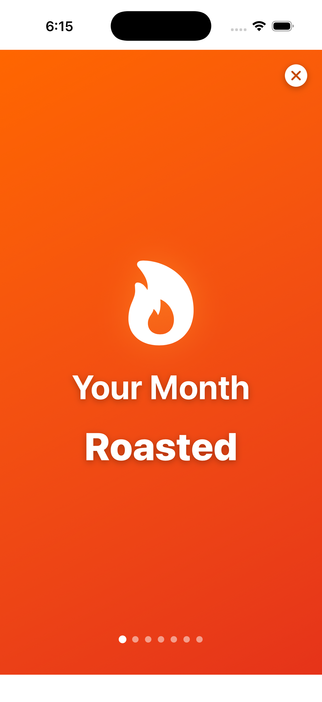
  
  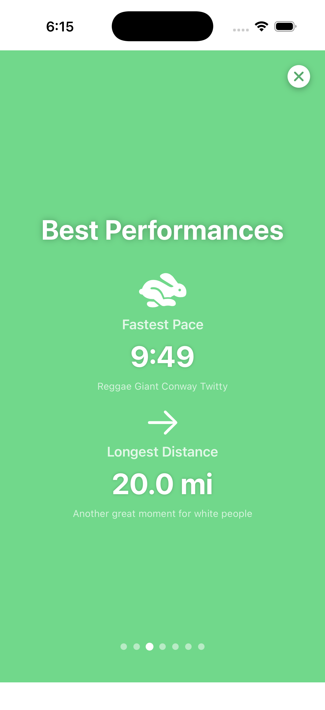
</p>

<p align="center">
  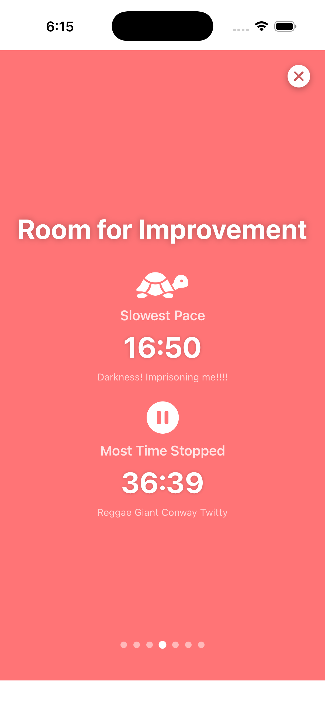
  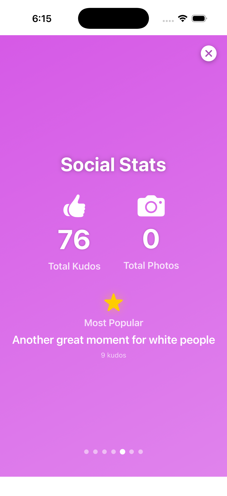
  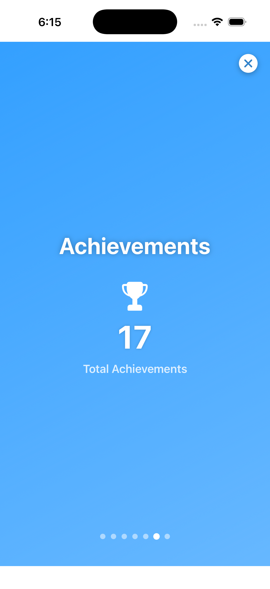
</p>

<p align="center">
  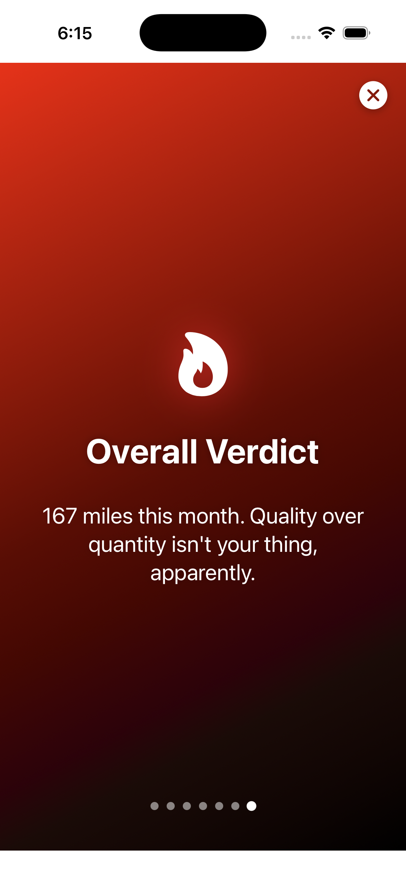
</p>

## What It Does

Spicy Strava connects to your Strava account and generates brutally honest roasts for your activities based on your pace, distance, elevation, stoppage time, kudos, and more. Choose your spice level from Mild to 🌶️🌶️🌶️ and get feedback that ranges from gentle encouragement to savage commentary.

### Features

- **OAuth Integration**: Secure Strava login
- **Activity Feed**: Infinite scroll through your activities with stats
- **Customizable Roasts**: Set different spice levels for different activity types (runs, rides, swims, hikes)
- **Activity Wrapped**: Swipeable full-screen slides for each activity with:
  - Stats breakdown (distance, pace, time)
  - Stoppage time roasts
  - Elevation gain commentary
  - Social stats (kudos, photos)
  - Segment achievements
  - Final verdict
- **Aggregate Wrapped**: Weekly/Monthly/Yearly/All-Time performance summaries with:
  - Total stats across all activities
  - Best and worst performances
  - Social highlights
  - Achievement counts
  - Overall period roast
- **The Receipts**: Stats dashboard with timeframe filtering
- **Auto-Post to Strava**: Automatically append roasts to your activity descriptions on Strava (optional)
- **Share**: Export roasts as images for Instagram stories
- **Roast Caching**: Roasts are saved per activity and spice level

## Tech Stack

- **SwiftUI**: Native iOS interface
- **Strava API**: OAuth authentication and activity data
- **URLSession**: Networking
- **@AppStorage**: Persistent settings and preferences

## Setup

1. **Clone the repo**
```bash
   git clone https://github.com/rhblitstein/StravaRoaster.git
   cd StravaRoaster
```

2. **Create your Strava API Application**
   - Go to https://www.strava.com/settings/api
   - Create a new application
   - Set Authorization Callback Domain to your redirect URI
   - Note your Client ID and Client Secret

3. **Configure the app**
   - Copy `Config.swift.example` to `Config.swift`
```bash
   cp StravaRoaster/Config.swift.example StravaRoaster/Config.swift
```
   - Edit `Config.swift` with your Strava credentials:
```swift
   struct Config {
       static let stravaClientID = "YOUR_CLIENT_ID"
       static let stravaClientSecret = "YOUR_CLIENT_SECRET"
       static let stravaRedirectURI = "activityroaster://activityroaster"
   }
```

4. **Open in Xcode**
```bash
   open StravaRoaster.xcodeproj
```

5. **Build and run**
   - Select a simulator or your device
   - Hit Run (Cmd+R)

## Project Structure
```
StravaRoaster/
├── Models/
│   └── StravaActivity.swift          # Activity data models
├── Services/
│   ├── StravaService.swift           # API integration
│   ├── MockRoastService.swift        # Roast generation
│   └── RoastCache.swift              # Roast persistence
├── Views/
│   ├── ContentView.swift             # Auth state handler
│   ├── LoginView.swift               # Strava OAuth flow
│   ├── MainTabView.swift             # Tab navigation
│   ├── ActivitiesView.swift          # Activity feed
│   ├── ActivityDetailView.swift      # Activity details + roast
│   ├── WrappedSlidesView.swift       # Activity wrapped slides
│   ├── YouView.swift                 # Stats dashboard
│   ├── AggregateWrappedView.swift    # Period wrapped slides
│   └── SettingsView.swift            # App settings
├── Config.swift                      # API credentials (gitignored)
└── Config.swift.example              # Template for credentials
```

## Settings

- **Roast Preferences**: Set default spice level and per-sport overrides
- **Auto-post to Strava**: Toggle automatic posting of roasts to activity descriptions
- **Logout**: Clear authentication

## How It Works

1. **Authentication**: OAuth 2.0 flow with Strava
2. **Activity Fetching**: Pulls activities with pagination (20 per page)
3. **Roast Generation**: Mock service generates roasts based on activity stats and chosen spice level
4. **Caching**: Roasts are cached with composite key (activityId + spiceLevel)
5. **Strava Integration**: Optional auto-posting to activity descriptions via Strava API

## Future Enhancements

- Real AI integration (OpenAI, Anthropic, or Together.ai)
- Weekly/Monthly email digests
- Leaderboards (worst pace, most stopped time, etc.)
- Friends comparison
- More activity types (swims, yoga, etc.)

## Contributing

This is a personal project, but feel free to fork and make it your own!

## Acknowledgments

- Strava API for the data
- My terrible running pace for inspiration (don't call it a comeback!)

---

**Disclaimer**: This app is not affiliated with Strava. All roasts are generated locally and are meant in good fun. Please don't take them too seriously (but also maybe work on that pace).